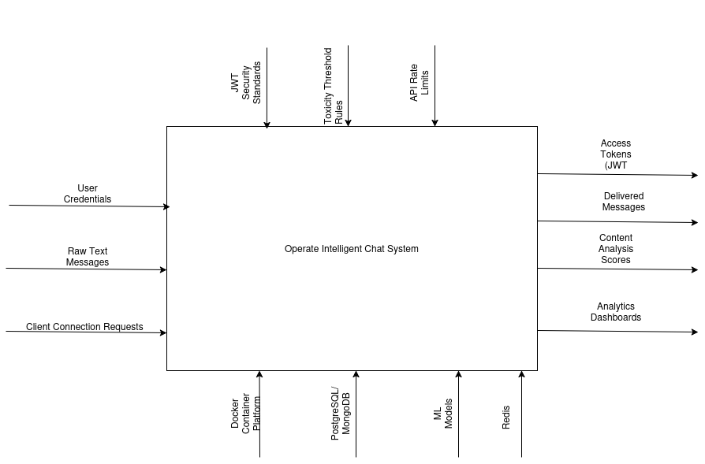

# 🚀 Microservices Intelligent Chat System


A scalable, microservices-based chat platform designed to integrate **Machine Learning** for real-time content analysis (toxicity detection, sentiment analysis). 

This project demonstrates the transition from monolithic architecture to a distributed system, focusing on **DevOps best practices**, **security**, and **clean architecture**.

---

## 🏗 Architecture & Design



The system is designed using **IDEF0** and **IDEF3** methodologies to ensure logical data flow and process separation.


### Key Features
* **Microservices Architecture:** Services communicate via REST (currently) and will evolve to event-driven communication (RabbitMQ/Redis).
* **Security First:** No hardcoded credentials. All sensitive data is managed via **Docker Secrets**.
* **Service-Repository Pattern:** The codebase follows a strict separation of concerns:
    * **Routers:** Handle HTTP requests and Pydantic validation.
    * **Services:** Encapsulate business logic.
    * **Repositories:** Abstract database interactions using SQLAlchemy.
* **Infrastructure as Code:** Fully containerized environment using Docker Compose.

---

## 🛠 Tech Stack

* **Core:** Python 3.12, FastAPI
* **Database:** PostgreSQL (AsyncPG + SQLAlchemy), Alembic for migrations
* **Infrastructure:** Docker, Docker Compose
* **Authentication:** JWT (JSON Web Tokens), OAuth2 Password Flow
* **Future Integrations:** Redis (Pub/Sub), RabbitMQ, Celery, PyTorch, MongoDB

---

## 📦 Services Overview

| Service | Role | Status |
| :--- | :--- | :--- |
| **Auth Service** | Gateway Guard. Handles Registration, Login, and JWT issuance. | ✅ **Completed** |
| **Chat Service** | Core messaging logic. Stores history and manages user interactions. | 🟡 **Active Dev** |
| **ML Core** | "The Brain". Analyzes messages for toxicity (Async workers). | 🔜 *Planned* |
| **Analytics** | Aggregates data for dashboards. | 🔜 *Planned* |

---

## 🚀 Getting Started

Since this project uses **Docker Secrets** for security, you need to set up the environment keys manually before running.

### 1. Clone the repository
```bash
git clone [https://github.com/thatwhocode/microservices.git](https://github.com/thatwhocode/microservices.git)
```
```bash
cd YOUR_REPO_NAME
```
2. Setup Secrets

Create a secrets/ folder in the root directory. This folder is gitignored for security. Add the following files inside it:

    jwt_secret_key.txt (Put a random string inside)

    postgres_auth_password.txt

    postgres_chat_password.txt

    (Add other DB credentials as defined in docker-compose.yml)
```bash
    mkdir secrets
```    
Example command to generate a secret:
```bash
        echo -n "super_secure_password" > secrets/postgres_auth_password.txt
        echo -n "my_jwt_secret" > secrets/jwt_secret_key.txt
```
Run with Docker Compose
```bash 
docker-compose up -d --build
Apply Migrations
```

Initialize the database tables for both services
```bash 
# Apply Auth Service migrations
docker-compose exec api -c auth_service/alembic.ini upgrade head

# Apply Chat Service migrations
docker-compose exec chat -c chat_servicer/alembic.ini  upgrade head
```
Roadmap

    [x] Infrastructure: Docker Compose networking & Secrets management.

    [x] Auth Service: Complete user lifecycle (Register/Login/Me) with JWT.

    [x] Chat Service (MVP): Basic REST API for sending messages with Sender UUID validation.

    [x] Database: Async SQLAlchemy + Alembic integration.

    [ ] Real-time: Refactor Chat Service to use WebSockets.

    [ ] Message Broker: Integrate Redis for Pub/Sub.

    [ ] ML Integration: Set up RabbitMQ and Celery for toxicity analysis.

    [ ] History Service: Migrate message storage to MongoDB.